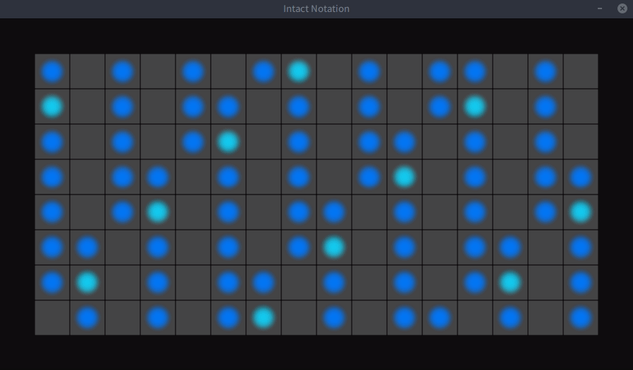

# Intact Notation

*A simpler musical notation that works well with LinnStrument*

*... AND a simple desktop app to visualize it*

## The software

Available for [Linux, macOS, and Windows](https://github.com/staltz/intact/releases). Plug in a MIDI instrument and open the program. Press the MIDI keys and see the Intact notation on the center of the screen. The grid in the background displays a *LinnStrument 128*. This software is basically built for myself, because that's the device I use, with those specific colors on the grid.

Built with the [Godot game engine](https://godotengine.org) because I felt like it, and because Godot allowed me to build this in about 3 hours max. I probably spent more time writing this README than writing the code. It's also really nice how Godot can export to desktop OSs easily and quickly.

## The musical notation

### Notes

Every note is a character of the alphabet. Lowercase characters are used to resemble their classical counter parts. Essentially (classical) `X♯` = `x` (intact).

| Intact    | C | c  | D | d  | E | F | f  | G | g  | A | a  | B |
|-----------|---|----|---|----|---|---|----|---|----|---|----|---|
| Classical | C | C♯ | D | D♯ | E | F | F♯ | G | G♯ | A | A♯ | B |

When pronouncing these notes, we say "Gee sharp" for `g`, not "lowercase G". The Intact notation aims at facilitating reading notes, not pronouncing notes.

### Intervals

The intervals in Intact are named as simple numbers, where `(N)` is the minor of `N`.

| Intact interval | (2) | 2 | (3) | 3 | 4 | (5) | 5 | (6) | 6 | (7) | 7 | 8 |
|-----------------|-----|---|-----|---|---|-----|---|-----|---|-----|---|---|
| Classical interval | Minor 2nd | Major 2nd | Minor 3rd | Major 3rd | 4th | Diminished 5th | 5th | Minor 6th | Major 6th | Minor 7th | Major 7th | Octave |
| Semitones | 1 | 2 | 3 | 4 | 5 | 6 | 7 | 8 | 9 | 10 | 11 | 12 |

When pronouncing these intervals, `(N)` is "Minor Nth", for example `(5)` is "Minor 5th". We don't say "diminished" or "augmented".

### Chords

> **Intact** = **Int**erval **ac**cumula**t**ion

To denote chords, the idea is to write **the root note** followed by all the **intervals accumulated**, leaving no interval implicit.

Examples:

| Classical Chord | Classical Breakdown | Intact Breakdown | Intact Chord |
|-----------------|-----------|--------------|----------|
| C | C + major 3rd + 5th + octave | C + 3 + 5 + 8 | **C358** |
| F♯m | F♯ + minor 3rd + 5th + octave | f + (3) + 5 + 8 | **f(3)58** |
| Amaj7 | A + major 3rd + 5th + major 7th | A + 3 + 5 + 7 | **A357** |

Note that the classical notation allows ambiguity, you can play F♯m with various intervals omitted, and it's still F♯m. Intact notation aims at being more precise at what's actually being played. Examples:

| Classical Chord | Intact Chord | Alternative 1 | Alternative 2 | Alternative 3 |
|-----------------|--------------|---------------|---------------|---------------|
| F♯m             | **f(3)58**   | **f(3)8** | **f(3)** | **f(3)5** |

"Compound intervals", in other words, intervals that go higher than an octave, like the 9th or 11th are written as conventional Intact intervals, but written after a `^` symbol, to indicate that they lie in the higher octave. Examples:

| Classical Chord | Classical Breakdown | Intact Breakdown | Intact Chord |
|-----------------|---------------------|------------------|--------------|
| C(add9)   | C + major 3rd + 5th + 9th | C + 3 + 5 + ^2   | **C35^2**     |

So we often use the `^` symbol for inverted chords, e.g.

| Classical Chord | Intact Chord | Intact Chord alternative |
|-----------------|--------------|--------------------------|
| F♯m             | **f(3)58**   | **f8^(3)**               |
| Cm7             | **C(3)5(7)** | **C(7)^(3)**             |
| Cmaj7           | **C357**     | **C7^3**                 |

## Names

For orally talking about chords (e.g. in a rehearsal), this notation itself is not convenient. E.g. **C(7)^(3)** is "C minor seventh up minor third" isn't fun. So we need simple names to describe the chord, and its related inversions. The cheatsheet below introduces the names for each chord family.

## Cheatsheet

| Classical | Name    | Intact*     | Intact    | Intact    | Intact   | Intact |
|-----------|---------|-------------|-----------|-----------|----------|--------|
| C         | C major | C8^3        | C58^3     | C35       |          |        |
| C5        | C power | C5          |           |           |          |        |
| Csus4     | C four  | C4          | C45       |           |          |        |
| Csus2     |         | C25         | C2        |           |          |        |
| C(add9)   |         | C^23        | C35^2     | C5^2      | C5^23    |        |
| C6        |         | C6^3        | C68^3     | C56       | C356     |        |
| C6/9      |         | C6^23       | C56^2     | C6^2      | C356^2   |        |
| Cmaj7     | C delta | C7^3        | C357      | C37       |          |        |
| Cmaj9     |         | C7^23       | C357^2    | C37^2     | C57^2    |        |
| Cmaj7#11  |         | C7^3(5)     | C357^(5)  | C37^(5)   | C57^(5)  |        |
| Cmaj13    |         | C7^36       | C357^26   | C37^26    | C57^26   | C7^236 |
| Cm        | C minor | C8^(3)      | C(3)58    | C58^(3)   | C(3)5    |        |
| Cm(add9)  |         | C^2(3)      | C(3)5^2   |           |          |        |
| Cm6       |         | C6^(3)      | C(3)6     |           |          |        |
| Cmb6      |         | C(6)^(3)    | C(3)(6)   | C(3)5(6)  |          |        |
| Cm6/9     |         | C^2(3)6     | C(3)6^2   |           |          |        |
| Cm7       | C seven | C(7)^(3)    | C(7)^(3)5 | C5(7)^(3) | C(3)5(7) |        |
| Cm7b5     |         | C(5)(7)^(3) |           |           |          |        |
| Cm9       |         | C(7)^2(3)   |           |           |          |        |
| Cm11      |         | C(7)^2(3)4  |           |           |          |        |
| Cm13      |         | C(7)^2(3)45 |           |           |          |        |
| C7        | C sefta | C3(7)       | C(7)^3    |           |          |        |
| C7sus4    |         | C4(7)       | C(7)^4    |           |          |        |
| C7/9      |         | C(7)^2      | C3(7)^2   |           |          |        |
| C9sus4    |         | C4(7)^2     |           |           |          |        |
| C11       |         | C(7)^24     |           |           |          |        |
| C13       |         | C(7)^236    | C35(7)^26 | C(7)^26   |          |        |
| C13sus4   |         | C(7)^246    | C45(7)^26 |           |          |        |

(Intact* means this one feels comfortable on the LinnStrument)

## FAQ (Frequently Arising Quarrels)

### Why a new musical notation?

I personally find the classical musical notation weird and biased. Musically, all notes should be treated the same, they are just classes of sound frequencies, there shouldn't be notes that are "natural", yet notes like C# or Db are considered second-class notes. The piano layout cements this bias by placing these notes as the black keys. It annoys me, and it's why I prefer the LinnStrument which, like the guitar, makes all notes look and feel the same.

When reading classical chord notation, I was deeply bothered by how nonsensical and inconsistent they felt to me. C5 is logical, it's just C (root) plus the 5th, but why isn't Csus4 named just C4? What's up with Csus2? Why isn't it just C2? What does Csus4 share with Csus2 that makes them both be "sus"? Why do you assume that the chord "C" means C major? Shouldn't we call it Cmaj (major) and Cmin (minor)? Wouldn't that make sense since you call the seventh chords Cmaj7 and Cm7? Why do you drop "maj" in other cases? What's the word "add" doing in C(add9) and why don't you use the word "add" also in C6/9? What does "/" mean? Does it mean the same as "add"? Oh my gosh this stuff is messed up. That's why I made a simple alternative notation that has consistent rules and little bias.

### But there's still some bias here...

That's not a question but, yeah, I know, stuff like "major" versus "minor" is a bias. Also, maybe all the notes should be named uppercase, and a different character for each note.

With Intact, I tried to cement *my* biases. I wanted it to make sense for **me**. If it doesn't make sense for you, go make your own thing.

### Once you get used to classical notation, it will be logical

That's also not a question, but fine, let's talk about it. Basically, "once you get used to" ANYTHING, anything will be logical. You could get used to speaking all words backwards, and "once you get used to it", it would feel logical. You could get used to literally anything weird. This is not a good argument.

For people who are learning and trying to make sense out of this stuff, it just intimidates them to accept the golden standard blindly. The typical advice for initiating musicians confused by music theory is just "PRACTICE PRACTICE PRACTICE" and very little of critical thinking. I understand the classical notation will remain as the defacto language to talk about music, but I at least wanted a way of converting from nonsensical notation to logical notation for my own sake.

### But I don't like your notation

Look, I basically made this for myself and I don't have any agenda to "change the world" or change your habits with this. I could have kept this on my local hard-drive, but I thought "meh, might as well publish it, maybe someone will find it interesting". If you don't find it interesting nor useful, go surf something else on the internet. Why be angry at some random person's tiny project? Sheesh.

### No, I really really think you are wrong about music theory

Oh, you're THAT kind of person. Nope, don't have time for you.

## License

This README.md is licensed [CC-BY 4.0](https://creativecommons.org/licenses/by/4.0/) and the Godot project source code is licensed MIT.
